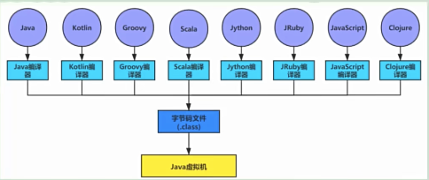
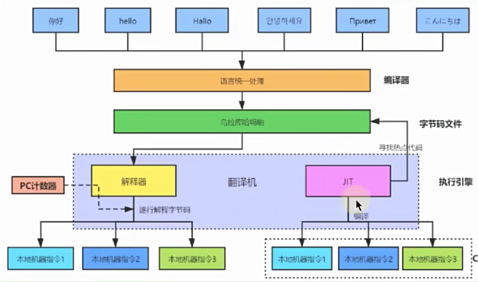
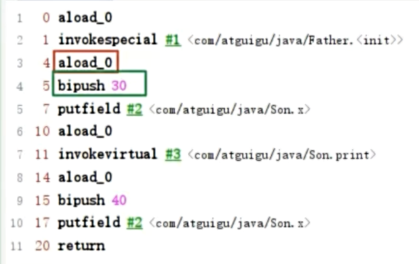
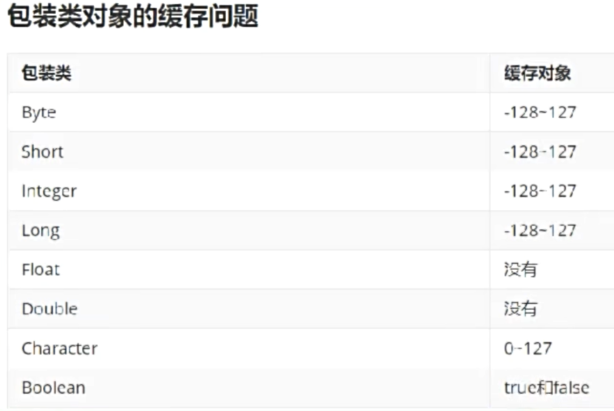
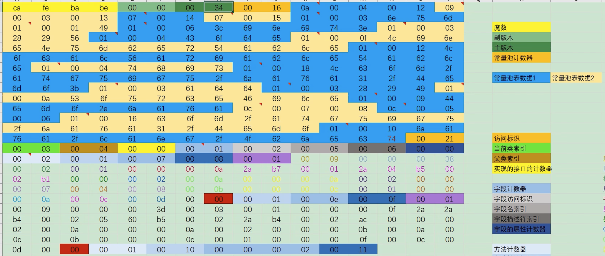
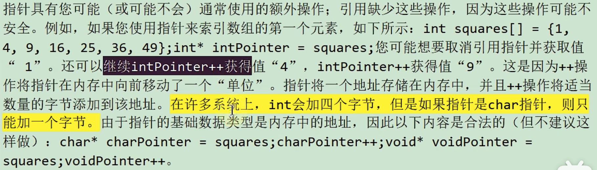

# 字節碼篇

## 字節碼文件概述

### 字節碼文件是跨平台的嗎？

**是！** Java虛擬機不合包括Java在內的任何語言綁定，他只與**Class文件**這種特定的二進制文件格式關聯。

#### Class文件裡面是什麼？

源代碼經過編譯器之後便會生成一個字節碼文件，字節碼是一種二進制的類文件，他的內容是JVM的指令，而不像C、C++經由編譯器直接生成**機器碼**。

#### 生成Class文件的編譯器

* 前端編譯器(編譯成`.class`文件) VS 後端編譯器(JIT)
  * **前端編譯器主要任務就是負責將符合Java語法規範的Java代碼轉換為符合JVM規範的字節碼文件**。
  * **JIT會尋找熱點代碼之後做一個緩存，並直接翻譯成機器指令執行，提高執行效率**(不過項目一開始部署後會比較慢，因為要找熱點代碼，是一個預熱的過程)
    * 使用**AOT**(Ahead Of Time Compiler)，是在**程序運行之前**，便將字節碼轉換為機器碼的過程。除去了預熱的這段時間。

#### javac編譯器的編譯步驟

詞法解析:point_right:語法解析:point_right:語意解析:point_right:生成字節碼

### 哪些類型對應有`Class`對象

1. class
2. interface
3. 數組：只要元素類型和維度一樣，就是同一個class
4. enum
5. annotation
6. primitive type：`int.class`
7. void：`void.class`

### 字節碼指令

Java虛擬機的指令由一個字節長度，代表著某種特定操作含義的**操作碼**(opcode)以及跟隨其後的零至多個代表此操作所需參數的**操作數**(oprand)所構成。虛擬機中許多指令並不包含操作數，只有一個操作碼。

可以使用**jclasslib插件**，重新編譯java文件後(Build -> Recompile)可以看到字節碼(View -> Show Bytecode)

包裝類的緩存

## Class文件結構細節

### Class文件結構概述

* 魔數：class文件的標示，每個Class文件開頭的4個字節的無符號整數稱為魔數，class文件的魔術固定值為0xCAFEBABE
* Class文件版本
* 常量池
* 訪問標示
* 類索引，父類索引，接口索引集合
* 字段表集合
* 方法表集合
* 屬性表集合

## Oracle官方的反解析工具`javap`

使用`javap -v [Class文件名]`，根據class字節碼文件，反解析出當前類對應的code區(字節碼指令)、局部變量表、異常表和代碼行偏移量映射表、常量池等信息。

## 面試題

* 為什麼不把基本類型放堆中？
  
  * 首先是棧、堆的特點不同(堆比棧還要大，但是棧的運算速度比較快)，將複雜數據類型放在對中的目的是為了不影響棧的效率，而是通過引用的方式去堆中查找。(八大基本類型的大小創建時候已經確立大小。三大引用類型創建時候無法缺定大小)
  * 簡單數據類型比較穩定，並且他只占據很小的內存，將他放在空間小、運算速度快的棧中，能夠提高效率。
* Java中的參數傳遞是傳值？還是傳引用？
  
  * 傳**值**
* Java中有沒有指針的概念？
  
  * 
    

