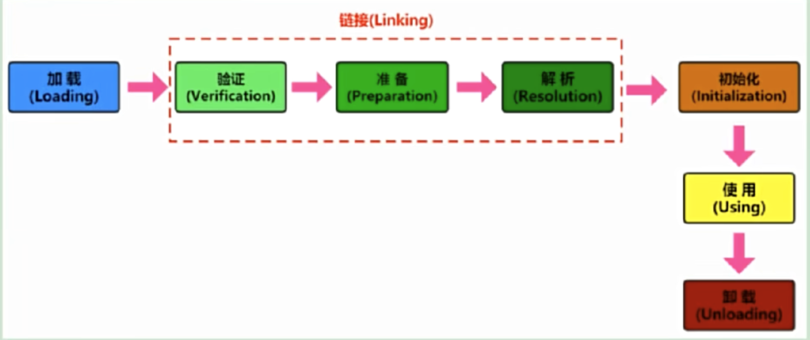
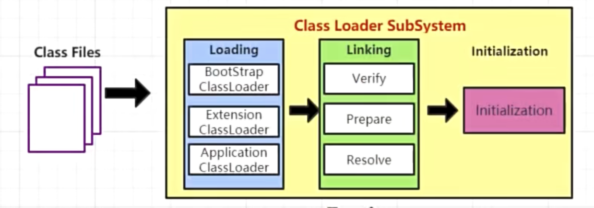
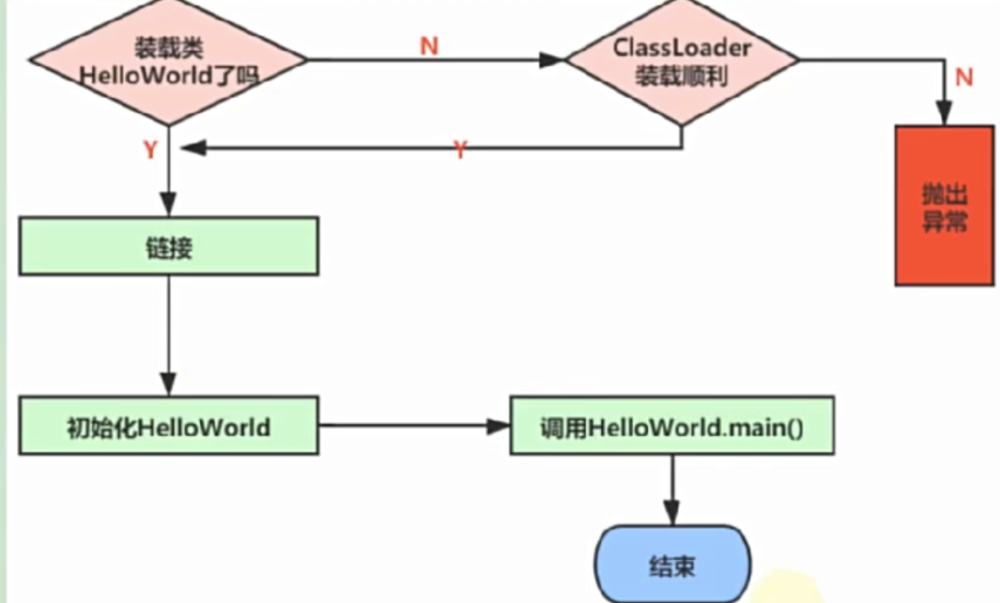
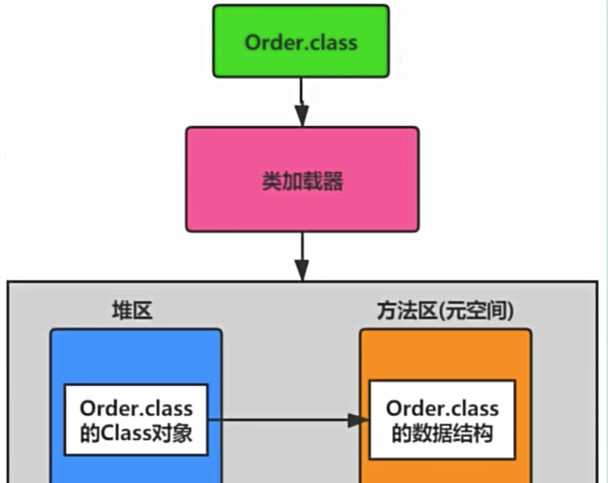
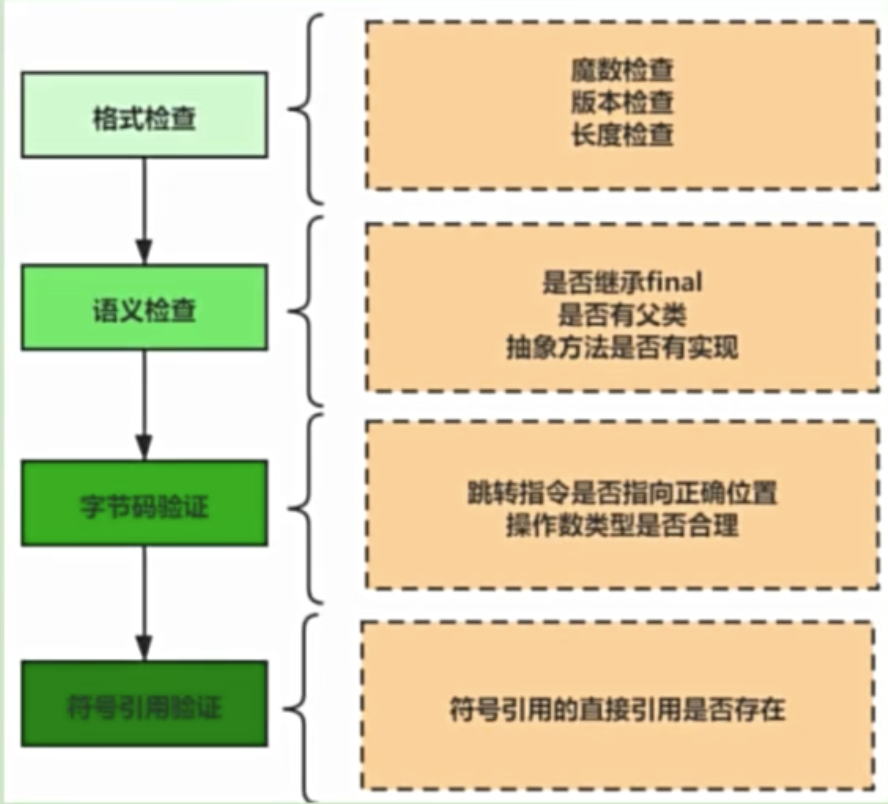
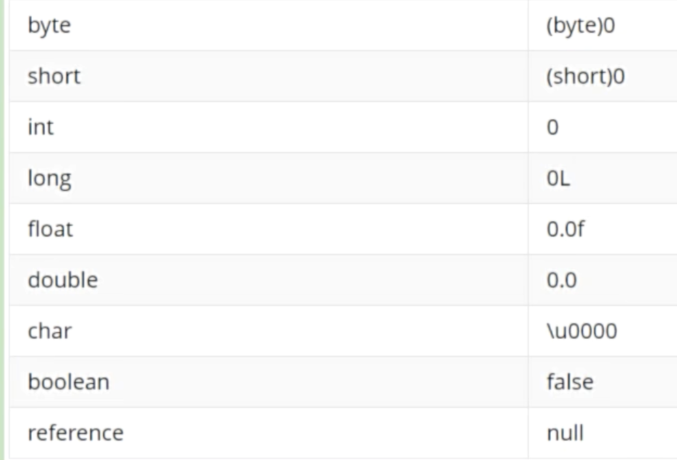

# 類的加載篇

## 類的加載過程(生命週期)

### 類加載分幾步

從程序中類的使用來看：

💡 誰需要加載：**基本數據類型由虛擬機預先定義，引用數據類型則需要進行類的加載**。

### 過程一：Loading裝載階段

所謂裝載，簡而言之就是**將Java類的字節碼文件加載到機器內存中，並在內存中構建出Java類的原型---類模板對象**。 👉 **查找並加載類的二進制數據，生成Class的實例。**

#### 類模板對象

就是Java類在JVM內存中的一個快照，JVM從字節碼文件中解析出的常量池、類字段、類方法等信息存儲到類模板中，這樣JVM在運行期間便能通過該模板獲取Java類中的任意信息。ex. 對該類成員變量進行遍歷、方法的調用。

💡 類模板的位置：加載類在JVM中創建對應的類結構，類結構會存儲在**方法區(JDK1.8之前：永久代。JDK1.8之後：元空間)**

#### Class實例的位置在哪

💡 如果為這個類起一個變量名，這個名就放在**棧**中。

💡 外部可以通過訪問Order類的Class對象來獲取Order的類數據結構。

💡 `Class`類的構造方法是私有的。

#### 數組類的加載

**因為數組類本身並不是由類加載器負責創建**，而是由JVM在運行時根據需要而直接創建的，但數組的類型仍然需要依靠類加載器去創建。 `String[] arr`

### 過程二：Linking鏈接階段

#### 鏈接階段之Verification驗證

他的目的是保證加載的字節碼是合法的合法、合理並且符合規範的。

💡 如果在這個階段無法通過檢查，虛擬機也不會正確裝載這個類。但是如果通過了這個階段的檢查，也不能說明這個類是完全沒有問題的。

#### 鏈接階段之Preparation準備

**為靜態變量分配內存，並將其初始化默認值**。

⚠️ 注意：

1. 這裡不包含基本數據類型的字段用`static final`修飾的情況，因為`final`在編譯的時候就會分配了，**準備階段會顯式賦值**。
2. 這裡不會為實例變量分配初始化，實例變量是會隨著對象一起分配到Java堆中。
3. 這個階段並**不會像初始化階段中那樣會有初始化或者代碼被執行**。

#### 鏈接階段之Resolution解析

將類、接口、字段和方法的符號引用轉為直接引用。

💡 解析就是將符號引用轉為直接引用，也就是得到類、字段、方法在內存中的指針或偏移量(在內存的地址)。因此可以說如果直接引用存在，那麼可以肯定系統中存在該類、方法或者字段。但只存在符號引用，不能確定系統中一定存在該結構。
💡 **鏈接階段中的解析操作往往會伴隨JVM在執行完初始化後再執行**。

### 過程三：Initialization初始化階段

